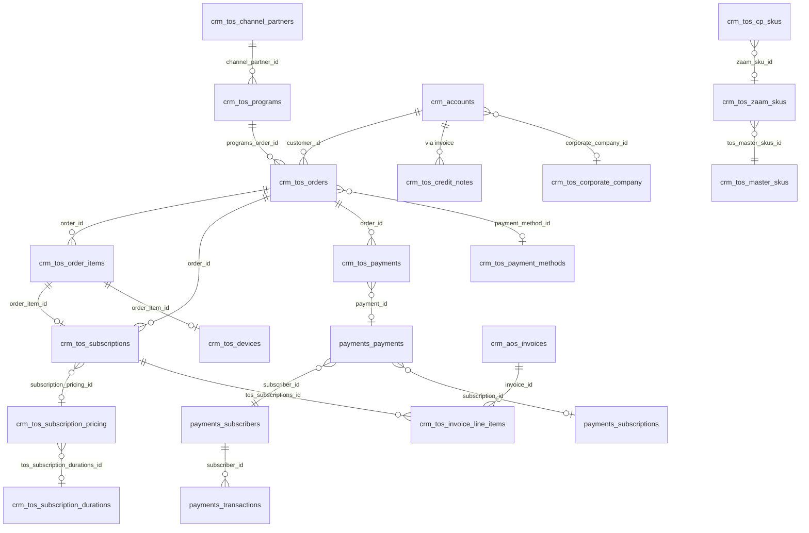

# Design Brief — Zension

**Status:** approved

> Generated from `[requirements.md](requirements.md)` and live schema discovery against `zension.source` (PostgreSQL).
>
> **Approval:** Review all sections, correct errors, then change status to `approved` before Phase 2 (sources + staging).
>
> **Discovery note:** `dbt show` / `dbt run-operation` require dbt-core with the Postgres adapter (project `.venv`). System `dbt` (Fusion 2.0) does not support Postgres. Profiling queries were executed via equivalent SQL against the warehouse.

---

## 1. Domain Summary

### Business context

Zension is a **B2B device reseller and subscription management platform** operating in **Saudi Arabia (KSA)**. Channel partners (Jarir, CEP, Axiom, FNF) sell hardware—often bundled with monthly subscriptions, damage protection, and corporate employee programs—through Zaam-branded customer and partner channels.

Core lifecycle:

**Partner setup** → **customer onboarding (Nafath identity + payment profile)** → **browse / order** → **checkout & card capture** → **invoice** → **device delivery** → **active subscription** → **recurring billing** → **renewal or closure**

Two commercial motions coexist:


| Motion                           | Description                                                                       |
| -------------------------------- | --------------------------------------------------------------------------------- |
| **Direct / CEP**                 | End customers self-serve; corporate email-domain validation for employee programs |
| **B2B pre-order (Jarir, Axiom)** | Partner creates order before delivery; subscription activates at device handover  |


### Business goals (from requirements)

- Sell devices and subscriptions through multiple channel partners from one platform
- Manage full subscription lifecycle (signup, delivery activation, recurring payments, cancellation, refund, upgrade)
- Automate invoicing and Zoho Books accounting sync (VAT, credit notes, journals)
- Verify identity (Nafath) and credit eligibility (CRDM) before high-value commitments
- Notify customers/partners via Mailchimp Transactional and Unifonic SMS
- Govern partner API access with data isolation
- Provide operations teams a single CRM view (SuiteCRM) for orders, devices, subscriptions, support

### Pain points driving this analytics layer


| Pain point                                                                    | Analytics implication                                                                                              |
| ----------------------------------------------------------------------------- | ------------------------------------------------------------------------------------------------------------------ |
| Revenue/subscription metrics differ by partner (Jarir/Axiom pre-order vs CEP) | Conformed dimensions for `channel_partner`, `program`, `order_type`; explicit pre-order vs fulfilled revenue flags |
| Dual payment truth (Payment Service vs Zoho Books vs CRM)                     | Reconciliation intermediate models across `crm_tos_payments`, `payments_`*, `crm_aos_invoices`                     |
| No executive dashboard; ad-hoc production CRM queries                         | Star schema + semantic layer with governed definitions                                                             |
| FNF partner rules undefined                                                   | Flag FNF program; exclude from partner SLAs until stakeholder sign-off                                             |
| Pre-order revenue timing                                                      | MRR only when `service_start_date` is set; exclude Waiting_For_Delivery from active MRR                            |
| Invoice sync one-way (CRM → Zoho)                                             | Finance metrics labeled CRM-sourced; Zoho reconciliation as separate mart                                          |


### Source systems in scope


| System                 | Schema prefix (this engagement)                                  | Role                                                                            |
| ---------------------- | ---------------------------------------------------------------- | ------------------------------------------------------------------------------- |
| **SuiteCRM (tos-ksa)** | `crm_`*                                                          | Operational CRM — orders, subscriptions, devices, customers, payments, invoices |
| **Payment Service**    | `payments_`*                                                     | Card capture, recurring billing, refunds (Stripe-backed subscribers observed)   |
| **Zoho Books**         | Partially mirrored in `crm_aos_invoices`, `crm_tos_credit_notes` | Invoicing, credit notes (`zoho_`* fields)                                       |


**Out of scope v1:** Nafath, CRDM, Mailchimp, Unifonic, AWS SNS raw logs (CRM `crm_tos_api_logs` used for partner webhook proxy metrics), Zoho Books direct API.

### Warehouse inventory

- **Database:** `zension`
- **Source schema:** `source`
- **Total tables in schema:** 322 (full SuiteCRM replica + Payment Service tables)
- **Tables in modeling scope:** 29 (see §3); remaining 293 deferred (audit tables, stock CRM modules, empty/stub tables)

### Key domain constraints for metrics

- **Market:** KSA — VAT applies (`crm_tos_countries.zoho_tax_id` referenced in requirements)
- **Currency:** SAR assumed for KSA programs (confirm with finance)
- **Exclude from revenue KPIs:** voided orders, fully refunded payments, subscriptions in Cancelled / Returned (report gross vs net separately where needed)
- **Active subscription definition:** `subscription_status = 'Active'` AND `service_start_date IS NOT NULL` (device delivered). Global active count (235 in discovery) is correct. **Not** the same as program limit utilization, which counts `Active` + `Waiting_For_Delivery` against `subscription_limit`
- **MRR definition:** `monthly_subscription_amount` from `crm_tos_subscription_pricing` for active subscriptions with a valid `subscription_pricing_id` only; exclude pre-delivery subs. **69 of 235 active subs lack pricing FK** (cycle-3 audit) — pending Product/Finance decision: exclude (current), impute from order pricing, or dashboard warning. `avg_subscription_term_months` uses identical eligibility
- **Partner isolation:** All partner-facing marts filterable by `channel_partner_id`

---

## 2. Business Questions → KPI Map


| #                         | Business question (requirements)                                                         | Primary KPI / metric                                                  | Grain                     | Subject area        |
| ------------------------- | ---------------------------------------------------------------------------------------- | --------------------------------------------------------------------- | ------------------------- | ------------------- |
| **Sales & orders**        |                                                                                          |                                                                       |                           |                     |
| 1                         | Orders and GMV by channel partner, program, month?                                       | `order_count`, `gmv_sar`                                              | Order × month             | Sales               |
| 2                         | Pre-order vs standard order share; avg time first paid payment → delivery?                 | `preorder_order_share`, `avg_days_payment_to_delivery`                | Order                     | Sales / Fulfillment |
| 3                         | Top device models (brand, storage, color) by partner?                                    | `order_item_count` by SKU attributes                                  | Order item                | Sales               |
| **Subscriptions**         |                                                                                          |                                                                       |                           |                     |
| 4                         | Subscriptions by status (Active, Waiting for Delivery, Cancelled, Defaulted) by partner? | `subscription_count` by status                                        | Subscription              | Subscriptions       |
| 5                         | MRR and average subscription term by program?                                            | `mrr_sar`, `avg_subscription_term_months`                             | Subscription × month      | Subscriptions       |
| 6                         | Churn and upgrade rate (KIFed / Upgraded) per quarter?                                   | `churn_rate` (quarter-scoped from monthly snapshots), `upgrade_rate` (quarter-scoped `is_upgraded_in_month` + `is_kifed_in_month`) | Subscription × quarter    | Subscriptions       |
| **Payments & finance**    |                                                                                          |                                                                       |                           |                     |
| 7                         | Collected vs invoiced vs recognized revenue by month?                                    | `collected_revenue_sar`, `invoiced_revenue_sar`, `finance_variance_sar` | Payment / invoice × month | Finance             |
| 8                         | Recurring installment payment failure rate; customers on retry?                          | `payment_failure_rate` (recurring installments only), `customers_on_retry_count` | Payment attempt           | Payments            |
| 9                         | Refund volume and credit-note value by partner and reason?                               | `refund_amount_sar` (CRM refunded payments only), `credit_note_count` | Refund / credit note      | Finance             |
| **Customers**             |                                                                                          |                                                                       |                           |                     |
| 10                        | Verified customers (Nafath + mobile OTP) by corporate company (CEP)?                     | `verified_customer_count`                                             | Customer                  | Customers           |
| 11                        | Avg devices-per-customer; subscription limit utilization?                                | `avg_devices_per_customer`, `program_subscription_utilization` (× multiplier when > 1) | Customer / program        | Customers           |
| 12                        | Customers with outstanding payments or expired cards?                                    | `customers_with_outstanding_payments` (unpaid invoices ∪ retry-queue failures only), `expired_payment_method_count` | Customer                  | Payments            |
| **Operations & partners** |                                                                                          |                                                                       |                           |                     |
| 13                        | Order-to-delivery SLA by partner and region?                                             | `median_order_to_delivery_days` (P90 under review), `sla_breach_count` | Order                     | Fulfillment         |
| 14                        | Partner webhook (SNS) failures / delays?                                                 | `partner_api_failure_rate`, `partner_api_failure_count`               | API log event             | Operations          |
| 15                        | Programs disabled or over subscription / payment-method limits?                          | `programs_over_limit_count`, `disabled_program_count`                 | Program                   | Operations          |


---

## 3. Source Inventory

### Prerequisite check (Phase 0)


| Check                    | Status      | Evidence                                                         |
| ------------------------ | ----------- | ---------------------------------------------------------------- |
| `dbt_project.yml`        | ✅ Present   | Project `zension`, staging/intermediate/marts schemas configured |
| `profiles.yml`           | ✅ Present   | Postgres `zension` @ localhost, schema `source`                  |
| `packages.yml` + codegen | ✅ Installed | `dbt deps` succeeded; codegen run via `.venv\Scripts\dbt.exe`    |
| Postgres connectivity    | ✅ Verified  | 322 tables in `source` schema                                    |


### Codegen

Full-schema codegen executed:

```bash
.venv\Scripts\dbt.exe run-operation generate_source --args "{schema_name: source, database_name: zension, generate_columns: true, name: source}" --profiles-dir .
```

Scoped codegen sample saved to `target/codegen_scoped_sources.yml`.

### In-scope tables (29) — classification


| Source table                     | Type          | Grain (1 row =)                  | Row count (live) | PK            | Notes                                     |
| -------------------------------- | ------------- | -------------------------------- | ---------------- | ------------- | ----------------------------------------- |
| `crm_tos_orders`                 | **Fact**      | One commercial order             | 16,043           | `id` (unique) | 887 soft-deleted                          |
| `crm_tos_order_items`            | **Fact**      | One line item on an order        | 33,377           | `id` (unique) | 1,667 soft-deleted                        |
| `crm_tos_subscriptions`          | **Fact**      | One device subscription          | 900              | `id` (unique) | Status-driven lifecycle                   |
| `crm_tos_devices`                | **Fact**      | One physical device asset        | 369              | `id` (unique) | brand/model/color on row                  |
| `crm_tos_payments`               | **Fact**      | One CRM payment record           | 22,327           | `id` (unique) | Links to order, invoice, PSP `payment_id` |
| `crm_tos_payment_history`        | **Fact**      | One payment attempt / card event | 9,897            | `id` (unique) | Retry / failure analysis                  |
| `crm_aos_invoices`               | **Fact**      | One Zoho-synced invoice          | 1,709            | `id` (unique) | `zoho_invoice_number`, `invoice_status`   |
| `crm_tos_invoice_line_items`     | **Fact**      | One invoice line                 | 3,408            | `id` (unique) | Links `tos_subscriptions_id`              |
| `crm_tos_credit_notes`           | **Fact**      | One credit note                  | 78               | `id` (unique) | `zoho_credit_note_id`                     |
| `crm_tos_api_logs`               | **Fact**      | One partner/API call             | 3,519            | `id` (unique) | 28 failures observed                      |
| `crm_tos_devices_journey`        | **Fact**      | One device journey milestone     | 14               | `id` (unique) | Sparse; delivery SLA supplement           |
| `payments_payments`              | **Fact**      | One PSP payment intent           | 8,495            | `id` (unique) | Links `subscriber_id`, `subscription_id`  |
| `payments_transactions`          | **Fact**      | One PSP transaction              | 2,843            | `id` (unique) | `process_status`, `request_status`        |
| `payments_refunds`               | **Fact**      | One PSP refund                   | 38               | `id` (unique) | `amount`, `status`                        |
| `crm_accounts`                   | **Dimension** | One customer account             | 2,956            | `id` (unique) | Nafath, mobile OTP, corporate link        |
| `crm_tos_channel_partners`       | **Dimension** | One channel partner              | 20               | `id` (unique) | Jarir, ZAAM, Axiom, Zaam Zension          |
| `crm_tos_programs`               | **Dimension** | One commercial program           | 30               | `id` (unique) | CEP, Jarir, FnF, Tradeling                |
| `crm_tos_corporate_company`      | **Dimension** | One CEP employer entity          | 19               | `id` (unique) | `allowed_email_domains`                   |
| `crm_tos_master_skus`            | **Dimension** | One master device SKU            | 408              | `id` (unique) | brand, model, memory, color               |
| `crm_tos_zaam_skus`              | **Dimension** | One Zaam program SKU             | 408              | `id` (unique) | FK → `tos_master_skus_id`                 |
| `crm_tos_cp_skus`                | **Bridge**    | Channel-partner ↔ SKU mapping    | 468              | `id` (unique) | Partner-specific catalog                  |
| `crm_tos_subscription_pricing`   | **Dimension** | One price list entry             | —                | `id`          | `monthly_subscription_amount` for MRR     |
| `crm_tos_subscription_durations` | **Dimension** | One term option (months)         | —                | `id`          | `duration`, linked to program             |
| `crm_tos_addresses`              | **Dimension** | One customer/partner address     | 426              | `id` (unique) | Region for SLA                            |
| `crm_tos_payment_methods`        | **Dimension** | One stored CRM payment method    | 4,255            | `id` (unique) | Card expiry fields                        |
| `crm_tos_countries`              | **Dimension** | One country (VAT config)         | —                | `id`          | KSA tax IDs                               |
| `payments_subscribers`           | **Dimension** | One PSP subscriber               | 146              | `id` (unique) | `stripe_id`                               |
| `payments_subscriptions`         | **Dimension** | One PSP subscription             | 609              | `id` (unique) | No direct CRM FK column                   |
| `payments_payment_methods`       | **Dimension** | One PSP payment method           | 222              | `id` (unique) | Card-on-file at PSP                       |


### Explicitly deferred (not modeled in v1)


| Table(s)                                                    | Reason                                                                 |
| ----------------------------------------------------------- | ---------------------------------------------------------------------- |
| All `*_audit` tables (150+)                                 | Change history only; not needed for KPIs                               |
| `crm_tos_invoices`                                          | **0 rows** — use `crm_aos_invoices`                                    |
| `payments_scheduled_payments`                               | **0 rows**                                                             |
| `crm_tos_payment_schedules`                                 | **5 rows** — insufficient for installment mart; revisit when populated |
| Stock CRM (`crm_cases`, `crm_campaigns`, `crm_leads`, etc.) | Not required for v1 business questions                                 |
| `crm_accounts_cstm`                                         | Custom fields appear flattened into `crm_accounts` in this replica     |


### Discovery findings by table (6-step summary)

#### `crm_tos_orders`

- **Grain:** 1 row per order (`id` unique across 16,043 rows)
- **Sample statuses:** `expired` (13,466), `rejected` (826), `waiting_for_delivery` (607), `delivered` (174), `cancelled` (83)
- **Order types:** `order` (14,039), null (1,115), `pre-order` (2)
- **GMV (non-cancelled/rejected/expired):** 781 orders, SAR 220,310 `total_tos_amount_incl_vat`
- **FK orphans:** `customer_id` → `crm_accounts`: **1,441** orphans; `programs_order_id` → programs: clean via join
- **Key columns:** `order_status`, `order_type`, `total_tos_amount_incl_vat`, `customer_id`, `programs_order_id`, `delivered_on`, `sales_channel`

#### `crm_tos_order_items`

- **Grain:** 1 row per order line item
- **FK orphans:** `order_id` → orders: **213**; `zaam_sku_id` → zaam_skus: **3,399** (majority — many items use `cp_sku_id` or blank SKU)
- **Key columns:** `order_id`, `zaam_sku_id`, `cp_sku_id`, `customer_id`, line amounts

#### `crm_tos_subscriptions`

- **Grain:** 1 row per subscription
- **Statuses:** `Waiting_For_Delivery` (528), `Active` (235), `Cancelled` (59), `Upgraded` (4)
- `**subscription_price`:** null on all rows — MRR must come from `crm_tos_subscription_pricing.monthly_subscription_amount`
- **Active MRR (joined pricing):** SAR 43,219 across 166 subs with pricing link (69 active subs missing pricing FK)
- **FK orphans:** `customer_id` → accounts: **601**; `order_id` → orders: **0**; `channel_partner_id` → partners: **0**

#### `crm_tos_devices`

- **Grain:** 1 row per device asset (serial/IMEI)
- **Top models:** iPhone 17, Galaxy S26, iPhone Air (from `brand`, `model`, `device_memory`, `color`)
- **FK orphans:** `order_item_id` → order_items: **3**; via order_item to subscription: **5**

#### `crm_tos_payments`

- **Grain:** 1 row per CRM payment
- **Statuses:** `not_invoiced` (13,451), `failed` (6,066), `paid` (1,412), `cancelled` (742), `refunded` (81)
- **Refunds:** SAR 64,697 across 81 refunded payments
- **FK orphans:** `order_id` → orders: **32**; `payment_id` → `payments_payments`: **141**

#### `crm_tos_payment_history`

- **Grain:** 1 row per card capture attempt
- **Statuses:** `failed` (7,927), `paid` (1,856), `Approved` (96) — **inconsistent casing** requires standardization
- **Use:** Recurring failure rate, retry analysis via `error_code`, `error_reason`

#### `crm_aos_invoices`

- **Grain:** 1 row per invoice
- **Statuses:** `paid` (1,085), `unpaid` (579)
- **Key columns:** `total_amount`, `vat_amount`, `zoho_invoice_number`, `billing_account_id`, `invoice_status`

#### `crm_tos_invoice_line_items`

- **Grain:** 1 row per invoice line
- **Links:** `tos_subscriptions_id`, `line_item_id`, amounts ex/incl VAT

#### `crm_tos_credit_notes`

- **Grain:** 1 row per credit note (78 rows)
- **Zoho fields:** `zoho_credit_note_id`, `zoho_status`, `credit_note_zoho_url`

#### `crm_accounts` (customers)

- **Grain:** 1 row per customer
- **Verification:** Nafath verified + mobile "Yes": **2,290**; Nafath only: 47; neither: 360
- `**is_mobile_verified`:** character (`Yes`/`No`), not boolean
- **CEP link:** `corporate_company_id` → `crm_tos_corporate_company`
- **Zoho link:** `zoho_customer_id`

#### `crm_tos_channel_partners`

- **Active partners (sample):** Jarir, ZAAM, Axiom, Zaam Zension
- **Types:** Retailer, ecommerce

#### `crm_tos_programs`

- **Programs with orders:** Jarir (14,041), Tradeling/Axiom (391), CEP (365), FnF (359)
- **3 programs currently over `subscription_limit`** vs active + waiting subs

#### `payments_payments` / `payments_transactions`

- **PSP transactions:** `completed/success` (719), `completed/failed` (109), `queued` (1,522)
- **No `status` column on `payments_payments`** — derive from linked transactions
- **CRM link:** `crm_tos_payments.payment_id` → `payments_payments.id` (86% match rate)

#### `crm_tos_api_logs`

- **Status:** `success` (3,426), `failure` (28) — **0.8% failure rate**

---

## 4. Relationship Graph




### Join keys and cardinality


| From                         | To                             | Join key                         | Cardinality | Orphan FK rows             |
| ---------------------------- | ------------------------------ | -------------------------------- | ----------- | -------------------------- |
| `crm_tos_order_items`        | `crm_tos_orders`               | `order_id` = `id`                | N:1         | **213**                    |
| `crm_tos_subscriptions`      | `crm_tos_orders`               | `order_id` = `id`                | N:1         | **0**                      |
| `crm_tos_subscriptions`      | `crm_accounts`                 | `customer_id` = `id`             | N:1         | **601**                    |
| `crm_tos_subscriptions`      | `crm_tos_channel_partners`     | `channel_partner_id` = `id`      | N:1         | **0**                      |
| `crm_tos_orders`             | `crm_accounts`                 | `customer_id` = `id`             | N:1         | **1,441**                  |
| `crm_tos_orders`             | `crm_tos_programs`             | `programs_order_id` = `id`       | N:1         | **0** (implicit)           |
| `crm_tos_programs`           | `crm_tos_channel_partners`     | `channel_partner_id` = `id`      | N:1         | **0**                      |
| `crm_tos_order_items`        | `crm_tos_zaam_skus`            | `zaam_sku_id` = `id`             | N:1         | **3,399**                  |
| `crm_tos_zaam_skus`          | `crm_tos_master_skus`          | `tos_master_skus_id` = `id`      | N:1         | TBD at build               |
| `crm_tos_cp_skus`            | `crm_tos_zaam_skus`            | zaam/cp sku keys                 | N:M bridge  | TBD                        |
| `crm_tos_subscriptions`      | `crm_tos_subscription_pricing` | `subscription_pricing_id` = `id` | N:1         | **69 active subs missing** |
| `crm_tos_devices`            | `crm_tos_order_items`          | `order_item_id` = `id`           | 1:1-ish     | **3**                      |
| `crm_tos_payments`           | `crm_tos_orders`               | `order_id` = `id`                | N:1         | **32**                     |
| `crm_tos_payments`           | `payments_payments`            | `payment_id` = `id::text`        | N:1         | **141**                    |
| `payments_payments`          | `payments_subscribers`         | `subscriber_id` = `id`           | N:1         | TBD                        |
| `crm_tos_invoice_line_items` | `crm_tos_subscriptions`        | `tos_subscriptions_id` = `id`    | N:1         | TBD                        |
| `crm_accounts`               | `crm_tos_corporate_company`    | `corporate_company_id` = `id`    | N:1         | TBD                        |


### CRM ↔ PSP reconciliation strategy

- **Primary bridge:** `crm_tos_payments.payment_id` → `payments_payments.id`
- **Secondary:** `payments_payments.subscription_id` → `payments_subscriptions.id` (no native CRM `subscription_id` match — 609 PSP subs unmatched to CRM UUID); reconcile via `crm_tos_subscriptions.subscription_uid` or payment metadata in `payments_subscribers.data` / `stripe_metadata` during intermediate modeling
- **Flag:** `is_psp_reconciled`, `reconciliation_gap_reason` on `int_payments_unified` — values include `no_psp_reference` (paid CRM row with null/blank `payment_id`), `missing_in_psp` (PSP join failed). CRM remains collected-revenue KPI source; flags support Finance reconciliation workflow (1,361 paid CRM rows without PSP reference; 51 missing in PSP per cycle-3 audit)

---

## 5. Column Standardization Plan

SuiteCRM exports use **char-padded strings**, inconsistent status casing, and boolean/char hybrids. All staging models apply:


| Rule                   | Implementation                                                            |
| ---------------------- | ------------------------------------------------------------------------- |
| Trim whitespace        | `trim()` on all char/text business columns                                |
| Lowercase status enums | `order_status`, `payment_status`, `subscription_status`, `invoice_status` |
| Snake_case renames     | See per-table map below                                                   |
| Soft-delete filter     | `where deleted = false` (CRM tables); `where deleted_at is null` (PSP)    |
| Timestamps             | Cast `date_entered` → `created_at`, `date_modified` → `updated_at`        |
| ETL metadata           | Pass through `_etl_synced_at`, `_etl_source_system`; exclude from marts   |
| Boolean normalization  | `is_mobile_verified`: `trim(val) ilike 'yes'` → boolean                   |


### Per-table renames and derived flags

#### `stg_crm__tos_orders`


| Source                      | Staging name      | Transform                                            |
| --------------------------- | ----------------- | ---------------------------------------------------- |
| `id`                        | `order_id`        | PK                                                   |
| `name`                      | `order_number`    | trim                                                 |
| `order_status`              | `order_status`    | trim, lower                                          |
| `order_type`                | `order_type`      | trim, lower; null → `'unknown'`                      |
| `total_tos_amount_incl_vat` | `gmv_amount_sar`  | numeric                                              |
| `customer_id`               | `customer_id`     | FK                                                   |
| `programs_order_id`         | `program_id`      | FK                                                   |
| `delivered_on`              | `delivered_at`    | timestamp                                            |
| `date_entered`              | `created_at`      |                                                      |
| `sales_channel`             | `sales_channel`   | trim, lower                                          |
| —                           | `is_preorder`     | `order_type = 'pre-order'`                           |
| —                           | `is_voided`       | `order_status in ('cancelled','rejected','expired')` |
| —                           | `is_gmv_eligible` | `not is_voided` per requirements                     |


#### `stg_crm__tos_subscriptions`


| Source                    | Staging name              | Transform                                                         |
| ------------------------- | ------------------------- | ----------------------------------------------------------------- |
| `id`                      | `subscription_id`         | PK                                                                |
| `subscription_status`     | `subscription_status`     | trim; map `Waiting_For_Delivery` → `waiting_for_delivery`         |
| `service_start_date`      | `service_started_at`      |                                                                   |
| `service_end_date`        | `service_ended_at`        |                                                                   |
| `subscription_pricing_id` | `subscription_pricing_id` | trim null-blank UUIDs to null                                     |
| `channel_partner_id`      | `channel_partner_id`      | FK                                                                |
| —                         | `is_active_subscription`  | `status = 'active' and service_started_at is not null`            |
| —                         | `is_mrr_eligible`         | `is_active_subscription AND subscription_pricing_id IS NOT NULL` (excludes 69 active subs missing pricing FK pending Product/Finance decision) |
| —                         | `is_churned`              | `status = 'cancelled'` (quarter-scoped via monthly snapshots, not lifetime) |
| —                         | `is_upgraded`             | `status = 'upgraded'`                                             |
| —                         | `is_kifed`                | `status in ('kifed', 'auto_kifed')` — **confirm with Product** if KIFed is upgrade vs churn |


#### `stg_crm__tos_payments`


| Source                         | Staging name           | Transform                     |
| ------------------------------ | ---------------------- | ----------------------------- |
| `payment_status`               | `payment_status`       | trim, lower                   |
| `payment_amount_tax_inclusive` | `collected_amount_sar` |                               |
| `refund_amount`                | `refund_amount_sar`    |                               |
| `payment_timestamp`            | `payment_timestamp`    | nullable in CRM; many paid rows lack timestamp |
| `payment_id`                   | `psp_payment_id`       | FK to PSP                     |
| —                              | `paid_at`              | `coalesce(payment_timestamp, created_at)` for finance month bucketing and payment→delivery SLA |
| —                              | `is_collected`         | `payment_status = 'paid'`     |
| —                              | `is_failed`            | `payment_status = 'failed'`   |
| —                              | `is_refunded`          | `payment_status = 'refunded'` |


#### `stg_crm__aos_invoices`


| Source           | Staging name        | Transform                                                                 |
| ---------------- | ------------------- | ------------------------------------------------------------------------- |
| `invoice_status` | `invoice_status`    | trim, lower                                                               |
| `total_amount`   | `invoice_amount_sar`| numeric                                                                   |
| `vat_amount`     | `vat_amount_sar`    | numeric                                                                   |
| —                | `is_paid`           | `invoice_status = 'paid'` — **pending Finance** sign-off on paid-invoice rule for Zoho/CRM validation (`tos_invoices` empty; raw MySQL `status` NULL) |
| —                | `is_unpaid`         | `invoice_status = 'unpaid'`                                               |


#### `stg_crm__accounts` (dim customer)


| Source                 | Staging name           | Transform                         |
| ---------------------- | ---------------------- | --------------------------------- |
| `national_id`          | `national_id`          | primary KSA identifier            |
| `nafath_verified`      | `is_nafath_verified`   | boolean                           |
| `is_mobile_verified`   | `is_mobile_verified`   | `trim ilike 'yes'`                |
| `corporate_company_id` | `corporate_company_id` | FK for CEP                        |
| `zoho_customer_id`     | `zoho_customer_id`     | finance reconciliation            |
| —                      | `is_fully_verified`    | nafath + mobile per program rules |


#### `stg_crm__tos_channel_partners` / `stg_crm__tos_programs`


| Source                 | Staging name                    | Transform                                                  |
| ---------------------- | ------------------------------- | ---------------------------------------------------------- |
| `name`                 | `partner_name` / `program_name` | trim                                                       |
| `channel_partner_type` | `partner_type`                  | trim, lower                                                |
| `program_status`       | `program_status`                | trim, upper → lower                                        |
| `subscription_limit`   | `subscription_limit`            | int                                                        |
| —                      | `is_fnf_program`                | `program_name ilike '%fnf%'` — flag for stakeholder review |


#### `stg_crm__master_skus` / `stg_crm__zaam_skus`


| Source                              | Staging name     | Transform                             |
| ----------------------------------- | ---------------- | ------------------------------------- |
| `brand`, `model`, `memory`, `color` | same             | trim — device analytics dimensions    |
| —                                   | `device_sku_key` | surrogate: `brand|model|memory|color` |


#### `stg_payments__transactions`


| Source           | Staging name     | Transform                                                     |
| ---------------- | ---------------- | ------------------------------------------------------------- |
| `process_status` | `process_status` | trim, lower                                                   |
| `request_status` | `request_status` | trim, lower                                                   |
| —                | `is_successful`  | `process_status = 'completed' and request_status = 'success'` |
| —                | `is_retry_queue` | `process_status = 'queued'`                                   |


#### `stg_crm__tos_payment_history`


| Source           | Staging name                  | Transform                                                                 |
| ---------------- | ----------------------------- | ------------------------------------------------------------------------- |
| `status`         | `payment_attempt_status`      | trim, lower; normalize `Approved` → `approved`                            |
| `is_recurring`   | `is_recurring_installment`    | boolean — **filter for `payment_failure_rate`** (recurring attempts only) |
| —                | `is_successful_attempt`       | status in (`paid`, `approved`)                                            |
| —                | `is_failed_attempt`           | status = `failed`                                                         |


---

## 6. Staging Model List


| Staging model                         | Source table                     | Layer schema |
| ------------------------------------- | -------------------------------- | ------------ |
| `stg_crm__accounts`                   | `crm_accounts`                   | `staging`    |
| `stg_crm__tos_orders`                 | `crm_tos_orders`                 | `staging`    |
| `stg_crm__tos_order_items`            | `crm_tos_order_items`            | `staging`    |
| `stg_crm__tos_subscriptions`          | `crm_tos_subscriptions`          | `staging`    |
| `stg_crm__tos_devices`                | `crm_tos_devices`                | `staging`    |
| `stg_crm__tos_payments`               | `crm_tos_payments`               | `staging`    |
| `stg_crm__tos_payment_history`        | `crm_tos_payment_history`        | `staging`    |
| `stg_crm__aos_invoices`               | `crm_aos_invoices`               | `staging`    |
| `stg_crm__tos_invoice_line_items`     | `crm_tos_invoice_line_items`     | `staging`    |
| `stg_crm__tos_credit_notes`           | `crm_tos_credit_notes`           | `staging`    |
| `stg_crm__tos_channel_partners`       | `crm_tos_channel_partners`       | `staging`    |
| `stg_crm__tos_programs`               | `crm_tos_programs`               | `staging`    |
| `stg_crm__tos_corporate_company`      | `crm_tos_corporate_company`      | `staging`    |
| `stg_crm__tos_master_skus`            | `crm_tos_master_skus`            | `staging`    |
| `stg_crm__tos_zaam_skus`              | `crm_tos_zaam_skus`              | `staging`    |
| `stg_crm__tos_cp_skus`                | `crm_tos_cp_skus`                | `staging`    |
| `stg_crm__tos_subscription_pricing`   | `crm_tos_subscription_pricing`   | `staging`    |
| `stg_crm__tos_subscription_durations` | `crm_tos_subscription_durations` | `staging`    |
| `stg_crm__tos_addresses`              | `crm_tos_addresses`              | `staging`    |
| `stg_crm__tos_payment_methods`        | `crm_tos_payment_methods`        | `staging`    |
| `stg_crm__tos_countries`              | `crm_tos_countries`              | `staging`    |
| `stg_crm__tos_api_logs`               | `crm_tos_api_logs`               | `staging`    |
| `stg_crm__tos_devices_journey`        | `crm_tos_devices_journey`        | `staging`    |
| `stg_payments__payments`              | `payments_payments`              | `staging`    |
| `stg_payments__transactions`          | `payments_transactions`          | `staging`    |
| `stg_payments__refunds`               | `payments_refunds`               | `staging`    |
| `stg_payments__subscribers`           | `payments_subscribers`           | `staging`    |
| `stg_payments__subscriptions`         | `payments_subscriptions`         | `staging`    |
| `stg_payments__payment_methods`       | `payments_payment_methods`       | `staging`    |


---

## 7. Relationship Resolution Plan (Intermediate)

Intermediate models resolve orphans, unify dual payment truth, and pre-compute business flags before marts.


| Intermediate model                   | Purpose                                                     | Key inputs                                    | Output grain         |
| ------------------------------------ | ----------------------------------------------------------- | --------------------------------------------- | -------------------- |
| `int_channel_partners`               | Conformed partner dimension                                 | `stg_crm__tos_channel_partners`               | 1 row / partner      |
| `int_programs`                       | Program + partner + limit utilization                       | programs, subscriptions                       | 1 row / program      |
| `int_device_skus`                    | Zaam SKU → master SKU attributes                            | zaam_skus, master_skus, cp_skus               | 1 row / zaam_sku     |
| `int_customers`                      | Customer + CEP company + verification flags                 | accounts, corporate_company                   | 1 row / customer     |
| `int_orders`                         | Order + program + partner + customer (nullable FK flagged)  | orders, programs, channel_partners, customers | 1 row / order        |
| `int_order_items`                    | Line item + order context + SKU (coalesce zaam/cp sku path) | order_items, orders, int_device_skus          | 1 row / line item    |
| `int_subscriptions`                  | Subscription + pricing MRR + duration + lifecycle flags     | subscriptions, pricing, durations, int_orders | 1 row / subscription |
| `int_devices`                        | Device + order item + subscription link                     | devices, order_items, subscriptions           | 1 row / device       |
| `int_payments_crm`                   | CRM payments with order/customer context                    | payments, orders                              | 1 row / CRM payment  |
| `int_payments_psp`                   | PSP payments + transaction outcome                          | payments_payments, transactions               | 1 row / PSP payment  |
| `int_payments_unified`               | CRM LEFT JOIN PSP on `payment_id`; reconciliation flags (`no_psp_reference`, `missing_in_psp`) | int_payments_crm, int_payments_psp            | 1 row / CRM payment  |
| `int_payment_attempts`               | Payment history + unified payment                           | payment_history, int_payments_unified         | 1 row / attempt      |
| `int_invoices`                       | Invoice + customer                                          | aos_invoices, customers                       | 1 row / invoice      |
| `int_invoice_line_items`             | Invoice lines + subscription                                | invoice_line_items, subscriptions             | 1 row / line         |
| `int_credit_notes`                   | Credit notes + invoice link                                 | credit_notes, invoices                        | 1 row / credit note  |
| `int_refunds`                        | CRM refunded payments only (source of record for `refund_amount_sar`; PSP rows excluded pending Finance sign-off) | `int_payments_crm` where `is_refunded` | 1 row / CRM refund |
| `int_finance_reconciliation`         | Monthly `SUM(collected) − SUM(invoiced)`; collected bucketed by `date_trunc('month', coalesce(payment_timestamp, created_at))` | unified payments, invoices, credit notes | 1 row / month        |
| `int_partner_api_events`             | API logs with partner attribution                           | api_logs, programs/partners                   | 1 row / API call     |
| `int_subscription_snapshots_monthly` | Month-end subscription status for **quarter-scoped** churn and upgrade; flags `is_active_at_month_start`, `is_churned_in_month`, `is_upgraded_in_month`, `is_kifed_in_month`; churn denominator = active at quarter start (`service_start_date` set; exclude `waiting_for_delivery`) | subscriptions + dates                         | 1 row / sub / month  |
| `int_customer_device_counts`         | Devices per customer                                        | devices, orders                               | 1 row / customer     |


### Orphan handling policy


| Scenario                                 | Policy                                                           |
| ---------------------------------------- | ---------------------------------------------------------------- |
| Order/customer FK orphans (1,441 orders) | Keep row; `customer_id` nullable; `has_valid_customer = false`   |
| Subscription/customer orphans (601)      | Keep row; flag for data quality test (warn threshold)            |
| Order item SKU orphans (3,399)           | Fall back to `cp_sku_id` → `int_device_skus`; else `sku_unknown` |
| CRM/PSP payment mismatch (141)           | Keep CRM row; `psp_reconciliation_status = 'missing_in_psp'`     |


---

## 8. Mart Star Schema

### `marts/sales/`


| Mart              | Type | Grain              | Key measures                              | Key dimensions                                                 |
| ----------------- | ---- | ------------------ | ----------------------------------------- | -------------------------------------------------------------- |
| `fct_orders`      | Fact | 1 row / order      | `gmv_amount_sar`, `total_discount_amount` | customer, program, channel_partner, order_date                 |
| `fct_order_items` | Fact | 1 row / order line | line amounts, quantity                    | order, device_sku (brand/model/memory/color), partner, program |


| Mart                      | Type      | Grain                | Notes                                      |
| ------------------------- | --------- | -------------------- | ------------------------------------------ |
| `dim_customers`           | Dimension | 1 row / customer     | From `int_customers`; SCD Type 1           |
| `dim_channel_partners`    | Dimension | 1 row / partner      | Jarir, ZAAM, Axiom, etc.                   |
| `dim_programs`            | Dimension | 1 row / program      | Includes `subscription_limit`, utilization ratio (active + waiting) ÷ limit |
| `dim_corporate_companies` | Dimension | 1 row / CEP employer | `allowed_email_domains`                    |
| `dim_device_skus`         | Dimension | 1 row / master SKU   | brand, model, memory, color                |
| `dim_dates`               | Dimension | calendar             | via `dbt_utils.date_spine`                 |


### `marts/subscriptions/`


| Mart                                 | Type | Grain                | Key measures                                |
| ------------------------------------ | ---- | -------------------- | ------------------------------------------- |
| `fct_subscriptions`                  | Fact | 1 row / subscription | `monthly_recurring_amount_sar`, term months; `program_id` FK for partner/program slicers |
| `fct_subscription_monthly_snapshots` | Fact | 1 row / sub / month  | `is_active_at_month_start`, `is_churned_in_month`, `is_upgraded_in_month`, `is_kifed_in_month`, `snapshot_quarter` |


| Mart                         | Type      | Grain                   |
| ---------------------------- | --------- | ----------------------- |
| `dim_subscription_pricing`   | Dimension | 1 row / pricing record  |
| `dim_subscription_durations` | Dimension | 1 row / duration option |


### `marts/payments/`


| Mart                   | Type | Grain                   | Key measures                                |
| ---------------------- | ---- | ----------------------- | ------------------------------------------- |
| `fct_payments`         | Fact | 1 row / CRM payment     | `collected_amount_sar`, `refund_amount_sar` |
| `fct_payment_attempts` | Fact | 1 row / attempt         | failure count, retry indicators             |
| `fct_psp_transactions` | Fact | 1 row / PSP transaction | success/fail                                |


| Mart                  | Type      | Grain                                      |
| --------------------- | --------- | ------------------------------------------ |
| `dim_payment_methods` | Dimension | CRM + PSP methods conformed where possible |


### `marts/finance/`


| Mart                                 | Type | Grain               | Key measures                           |
| ------------------------------------ | ---- | ------------------- | -------------------------------------- |
| `fct_invoices`                       | Fact | 1 row / invoice     | `invoice_amount_sar`, `vat_amount_sar` |
| `fct_invoice_line_items`             | Fact | 1 row / line        | line amounts                           |
| `fct_credit_notes`                   | Fact | 1 row / credit note | credit value                           |
| `fct_finance_reconciliation_monthly` | Fact | 1 row / month       | collected, invoiced, variance          |


### `marts/fulfillment/`


| Mart                        | Type | Grain                 | Key measures   |
| --------------------------- | ---- | --------------------- | -------------- |
| `fct_devices`               | Fact | 1 row / device        | purchase_price |
| `fct_device_journey_events` | Fact | 1 row / journey event | SLA timestamps |


### `marts/operations/`


| Mart                     | Type | Grain            | Key measures                         |
| ------------------------ | ---- | ---------------- | ------------------------------------ |
| `fct_partner_api_events` | Fact | 1 row / API call | failure flag, latency (if available) |


### `marts/bridge/`


| Mart             | Type   | Grain                      |
| ---------------- | ------ | -------------------------- |
| `bridge_cp_skus` | Bridge | channel_partner ↔ zaam_sku |


---

## 9. Semantic Metrics List

`ENABLE_SEMANTIC_LAYER: true` — metrics map to business questions in §2.


| Metric name                            | Type    | Definition                                                 | Source mart(s)                                     | Business questions |
| -------------------------------------- | ------- | ---------------------------------------------------------- | -------------------------------------------------- | ------------------ |
| `order_count`                          | simple  | Count of orders where `is_gmv_eligible`                    | `fct_orders`                                       | Q1                 |
| `gmv_sar`                              | simple  | Sum of `gmv_amount_sar` where `is_gmv_eligible`            | `fct_orders`                                       | Q1                 |
| `preorder_order_share`                 | ratio   | `preorder orders / eligible orders`; BI: `IF(EligibleOrders = 0, 0, DIVIDE(Preorders, EligibleOrders, 0))` — show **0%** when no pre-orders (never BLANK) | `fct_orders`                                       | Q2                 |
| `avg_days_payment_to_delivery`         | derived | `avg(delivered_at − first_paid_at)` days; `first_paid_at` = min `paid_at` on paid CRM payments per order (`coalesce(payment_timestamp, created_at)`) | `fct_orders` + `fct_payments`                      | Q2, Q13            |
| `order_item_count`                     | simple  | Count of order line items                                  | `fct_order_items`                                  | Q3                 |
| `subscription_count`                   | simple  | Count subscriptions by status dim                          | `fct_subscriptions`                                | Q4                 |
| `active_subscription_count`            | simple  | Count where `is_active_subscription` (`status = active` AND `service_started_at IS NOT NULL`). Partner/program slices require active `fct_subscriptions[program_id]` → `dim_programs` relationship in BI | `fct_subscriptions`                                | Q4                 |
| `mrr_sar`                              | simple  | Sum `monthly_recurring_amount_sar` where `is_mrr_eligible` (~166 subs / SAR 43,219 in audit; 69 active subs excluded pending Product/Finance pricing-gap decision) | `fct_subscriptions`                                | Q5                 |
| `avg_subscription_term_months`         | derived | Avg `subscription_term_months` where `is_mrr_eligible = TRUE` (same scope as MRR); BI: `AVERAGEX` over eligible rows only | `fct_subscriptions` + `dim_subscription_durations` | Q5                 |
| `churn_rate`                           | derived | **Quarter-scoped:** churned in selected quarter ÷ active at quarter start from `fct_subscription_monthly_snapshots` (not lifetime `DISTINCTCOUNT` over all snapshots). Denominator = delivered Active only (exclude `waiting_for_delivery`). Executive page requires quarter slicer on `snapshot_quarter` or equivalent measure filter — expect ~3.43% for Q4 2026, not 5.43% unfiltered | `fct_subscription_monthly_snapshots`               | Q6                 |
| `upgrade_rate`                         | derived | **Quarter-scoped:** (`is_upgraded_in_month OR is_kifed_in_month` in quarter) ÷ eligible active subs at quarter start from `fct_subscription_monthly_snapshots` — not lifetime `fct_subscriptions` (audit: 4/826 = 0.48% all-time). **Confirm with Product** that `kifed` / `auto_kifed` count as upgrades | `fct_subscription_monthly_snapshots`               | Q6                 |
| `collected_revenue_sar`                | simple  | Sum `collected_amount_sar` where `is_collected`            | `fct_payments`                                     | Q7                 |
| `invoiced_revenue_sar`                 | simple  | Sum `invoice_amount_sar` where `is_paid` on `fct_invoices` (~874,115 SAR in audit). Finance to validate against Zoho/CRM; paid-invoice rule pending sign-off | `fct_invoices`                                     | Q7                 |
| `finance_variance_sar`                 | derived | `SUM(collected) − SUM(invoiced)` by month; collected bucketed by `date_trunc('month', coalesce(payment_timestamp, created_at))`. Expected all-time gap ~27,821 SAR (901,936 − 874,115) | `fct_finance_reconciliation_monthly`               | Q7                 |
| `payment_failure_rate`                 | ratio   | Failed ÷ total **recurring installment** attempts only (`is_recurring_installment = TRUE` in `fct_payment_attempts`; not all payment history) | `fct_payment_attempts`                             | Q8                 |
| `customers_on_retry_count`             | derived | Distinct customers with queued PSP transactions            | `fct_psp_transactions`                             | Q8                 |
| `refund_amount_sar`                    | simple  | Sum `refund_amount_sar` from CRM `tos_payments` where `is_refunded` only (~64,697 SAR in discovery; exclude PSP union) | `fct_refunds`                                      | Q9                 |
| `credit_note_count`                    | simple  | Count credit notes                                         | `fct_credit_notes`                                 | Q9                 |
| `verified_customer_count`              | simple  | Customers with `is_fully_verified`                         | `dim_customers`                                    | Q10                |
| `avg_devices_per_customer`             | derived | Avg device count per customer                              | `fct_devices`                                      | Q11                |
| `program_subscription_utilization_pct` | ratio   | `AVERAGEX` of per-program (active + waiting subs) ÷ `subscription_limit`; when ratio > 1 display as **multiplier (×)** e.g. `3.1×`, not `307%`. **Confirm with Product:** keep `AVERAGEX` multiplier display OR switch to `SUM(utilization subs) / SUM(limits)` | `dim_programs`                                     | Q11, Q15           |
| `expired_payment_method_count`         | simple  | Payment methods past expiry                                | `dim_payment_methods`                              | Q12                |
| `customers_with_outstanding_payments`  | derived | Distinct customers in `UNION` of (a) unpaid `fct_invoices` and (b) retry-queue failures only (`fct_psp_transactions.is_retry_queue` OR recent `fct_payment_attempts` linked to queued PSP rows) — **exclude** all historical failed attempts. BI: `COUNTROWS(SUMMARIZE(UNION(...), customer_id))`. Pending Product confirmation of "outstanding" definition | `fct_invoices`, `fct_payment_attempts`, `fct_psp_transactions` | Q12                |
| `median_order_to_delivery_days`        | derived | Median `delivered_at − order_date` days; median 0 is valid when many same-day deliveries — **confirm with Product** on P90 alternative | `fct_orders`                                       | Q13                |
| `partner_api_failure_rate`             | ratio   | API failures / total calls                                 | `fct_partner_api_events`                           | Q14                |
| `programs_over_limit_count`            | simple  | Programs where (active + waiting) subs > limit               | `dim_programs`                                     | Q15                |
| `disabled_program_count`               | simple  | Count programs where `is_disabled_program = TRUE`; BI: `COALESCE(CALCULATE(COUNTROWS(dim_programs), is_disabled_program=TRUE), 0)` — show **0** when none | `dim_programs`                                     | Q15                |


### Power BI (`_KPIs` DAX) — cycle 3 fixes (measure audit 2026-06-24)

Target file: `powerbi/zension.pbix`. Update measures per `powerbi/report_build_guide.txt`. Validation spot-checks after Pass 2: Churn Rate ~**3.43%** for Q4 2026 with quarter slicer (not 5.43% unfiltered); Finance Variance ≈ **27,821 SAR**; Refund Amount ≈ **64,697 SAR**; Collected Revenue ≈ **901,936 SAR** (CRM).


| Measure | Agreed DAX / behavior |
| ------- | --------------------- |
| Finance Variance (SAR) | Sum `finance_variance_sar` from mart (monthly collected − invoiced after `paid_at` bucketing fix) |
| Refund Amount (SAR) | Sum CRM refunded payments only (not PSP union) |
| Churn Rate | Quarter-scoped from `fct_subscription_monthly_snapshots`: churned in selected quarter ÷ active at quarter start. **Mandatory** `snapshot_quarter` slicer on Executive page OR rewrite measure to default to current quarter — never sum all snapshot history unfiltered |
| Payment Failure Rate | `DIVIDE` failed recurring installments, total recurring installments |
| Upgrade Rate | Quarter-scoped from monthly snapshots: numerator `is_upgraded_in_month OR is_kifed_in_month` in quarter ÷ eligible at quarter start — not lifetime `fct_subscriptions` |
| Active Subscription Count | `is_active_subscription`; partner/program slices need active relationships (below) |
| Pre-order Share | `IF(EligibleOrders = 0, 0, DIVIDE(Preorders, EligibleOrders, 0))` — **0%** not BLANK |
| Avg Subscription Term (Months) | `AVERAGEX` filtered to `is_mrr_eligible = TRUE` (same scope as MRR; pending pricing-gap decision) |
| MRR (SAR) | Sum where `is_mrr_eligible`; dashboard note/warning if Product chooses to surface 69 subs without pricing |
| Customers with Outstanding Payments | `COUNTROWS(SUMMARIZE(UNION(unpaid_invoice_customers, retry_queue_failed_customers), customer_id))` — retry-queue failures only, not all historical failures |
| Program Subscription Utilization | `AVERAGEX` per program; `FORMAT(ratio, "0.0") & "×"` when ratio > 1 (format string `0.0\x` in PBIX). Pending Product: keep multiplier vs aggregate ratio |
| Disabled Program Count | `COALESCE(CALCULATE(COUNTROWS(dim_programs), is_disabled_program=TRUE), 0)` |
| Avg Days Payment to Delivery | First paid CRM payment (`paid_at`) → `delivered_on` |
| Median Order to Delivery Days | Keep median; document same-day delivery effect in tooltip |
| Collected Revenue (SAR) | CRM source of record; optional reconciliation drill-through on `no_psp_reference` / `missing_in_psp` flags |
| Invoiced Revenue (SAR) | Sum paid invoices per Finance-approved `is_paid` rule; validate ~874,115 SAR |

**Model relationships (activate if inactive):**

- `fct_orders[program_id]` → `dim_programs[program_id]`
- `fct_orders[customer_id]` → `dim_customers[customer_id]`
- `fct_subscriptions[program_id]` → `dim_programs[program_id]`


---

## 10. Work Batches

Codegen `generate_source` calls grouped **max 3 tables** per batch for Phase 2.


| Batch | Tables                 | codegen `--args` table_names                                                        |
| ----- | ---------------------- | ----------------------------------------------------------------------------------- |
| 1     | Orders core            | `crm_tos_orders`, `crm_tos_order_items`, `crm_tos_subscriptions`                    |
| 2     | Devices & CRM payments | `crm_tos_devices`, `crm_tos_payments`, `crm_tos_payment_history`                    |
| 3     | Finance (CRM)          | `crm_aos_invoices`, `crm_tos_invoice_line_items`, `crm_tos_credit_notes`            |
| 4     | Customer & partners    | `crm_accounts`, `crm_tos_channel_partners`, `crm_tos_programs`                      |
| 5     | CEP & catalog          | `crm_tos_corporate_company`, `crm_tos_master_skus`, `crm_tos_zaam_skus`             |
| 6     | Pricing & bridge       | `crm_tos_cp_skus`, `crm_tos_subscription_pricing`, `crm_tos_subscription_durations` |
| 7     | Supporting dims        | `crm_tos_addresses`, `crm_tos_payment_methods`, `crm_tos_countries`                 |
| 8     | Ops & PSP payments     | `crm_tos_api_logs`, `crm_tos_devices_journey`, `payments_payments`                  |
| 9     | PSP transactions       | `payments_transactions`, `payments_refunds`, `payments_subscribers`                 |
| 10    | PSP subs & methods     | `payments_subscriptions`, `payments_payment_methods`                                |


**Suggested Phase 2 build order:** Batch 4 → 1 → 2 → 6 → 5 → 3 → 7 → 8 → 9 → 10 (dimensions before facts).

---

## Appendix A — KPI Traceability Matrix


| Business question                             | Source table(s)                                                                           | Staging                                                                                                  | Intermediate                                                         | Mart                                                                 | Semantic metric                                                         |
| --------------------------------------------- | ----------------------------------------------------------------------------------------- | -------------------------------------------------------------------------------------------------------- | -------------------------------------------------------------------- | -------------------------------------------------------------------- | ----------------------------------------------------------------------- |
| Q1: Orders & GMV by partner/program/month     | `crm_tos_orders`, `crm_tos_programs`, `crm_tos_channel_partners`                          | `stg_crm__tos_orders`, `stg_crm__tos_programs`, `stg_crm__tos_channel_partners`                          | `int_orders`                                                         | `fct_orders`                                                         | `order_count`, `gmv_sar`                                                |
| Q2: Pre-order share & payment→delivery time   | `crm_tos_orders`, `crm_tos_payments`                                                      | `stg_crm__tos_orders`, `stg_crm__tos_payments`                                                           | `int_orders`, `int_payments_crm`                                     | `fct_orders`, `fct_payments`                                         | `preorder_order_share`, `avg_days_payment_to_delivery`                  |
| Q3: Top device models by partner              | `crm_tos_order_items`, `crm_tos_zaam_skus`, `crm_tos_master_skus`, `crm_tos_devices`      | `stg_crm__tos_order_items`, `stg_crm__tos_zaam_skus`, `stg_crm__tos_master_skus`                         | `int_order_items`, `int_device_skus`                                 | `fct_order_items`, `dim_device_skus`                                 | `order_item_count`                                                      |
| Q4: Subscriptions by status & partner         | `crm_tos_subscriptions`, `crm_tos_channel_partners`                                       | `stg_crm__tos_subscriptions`, `stg_crm__tos_channel_partners`                                            | `int_subscriptions`                                                  | `fct_subscriptions`                                                  | `subscription_count`, `active_subscription_count`                       |
| Q5: MRR & avg term by program                 | `crm_tos_subscriptions`, `crm_tos_subscription_pricing`, `crm_tos_subscription_durations` | `stg_crm__tos_subscriptions`, `stg_crm__tos_subscription_pricing`, `stg_crm__tos_subscription_durations` | `int_subscriptions`                                                  | `fct_subscriptions`, `dim_subscription_durations`                    | `mrr_sar`, `avg_subscription_term_months`                               |
| Q6: Churn & upgrade rate                      | `crm_tos_subscriptions`                                                                   | `stg_crm__tos_subscriptions` (+ `is_kifed`)                                                                  | `int_subscriptions`, `int_subscription_snapshots_monthly` (quarter-scoped churn + upgrade month flags) | `fct_subscription_monthly_snapshots`, `fct_subscriptions`              | `churn_rate`, `upgrade_rate`                                            |
| Q7: Collected vs invoiced revenue             | `crm_tos_payments`, `crm_aos_invoices`                                                    | `stg_crm__tos_payments` (+ `paid_at`), `stg_crm__aos_invoices` (+ `is_paid`)                               | `int_payments_unified` (+ reconciliation flags), `int_invoices`, `int_finance_reconciliation` | `fct_payments`, `fct_invoices`, `fct_finance_reconciliation_monthly` | `collected_revenue_sar`, `invoiced_revenue_sar`, `finance_variance_sar` |
| Q8: Payment failure & retry                   | `crm_tos_payment_history`, `payments_transactions`                                        | `stg_crm__tos_payment_history` (+ `is_recurring_installment`), `stg_payments__transactions`              | `int_payment_attempts` (recurring filter), `int_payments_psp`        | `fct_payment_attempts`, `fct_psp_transactions`                       | `payment_failure_rate`, `customers_on_retry_count`                      |
| Q9: Refunds & credit notes                    | `crm_tos_payments`, `crm_tos_credit_notes`                                                | `stg_crm__tos_payments`, `stg_crm__tos_credit_notes`                                                       | `int_refunds` (CRM only), `int_credit_notes`                         | `fct_refunds`, `fct_credit_notes`                                    | `refund_amount_sar`, `credit_note_count`                                |
| Q10: Verified customers by CEP company        | `crm_accounts`, `crm_tos_corporate_company`                                               | `stg_crm__accounts`, `stg_crm__tos_corporate_company`                                                    | `int_customers`                                                      | `dim_customers`, `dim_corporate_companies`                           | `verified_customer_count`                                               |
| Q11: Devices per customer & limit utilization | `crm_tos_devices`, `crm_tos_orders`, `crm_tos_programs`, `crm_tos_subscriptions`          | `stg_crm__tos_devices`, `stg_crm__tos_orders`, `stg_crm__tos_programs`                                   | `int_customer_device_counts`, `int_programs` (active + waiting ÷ limit) | `fct_devices`, `dim_programs`                                        | `avg_devices_per_customer`, `program_subscription_utilization_pct`      |
| Q12: Outstanding payments & expired cards     | `crm_tos_payment_methods`, `crm_aos_invoices`, `crm_tos_payment_history`, `payments_transactions` | `stg_crm__tos_payment_methods`, `stg_crm__aos_invoices`, `stg_crm__tos_payment_history`, `stg_payments__transactions` | `int_payment_attempts`, `int_invoices`, `int_payments_psp` (retry-queue filter) | `dim_payment_methods`, `fct_invoices`, `fct_psp_transactions`, `fct_payment_attempts` | `expired_payment_method_count`, `customers_with_outstanding_payments` (unpaid ∪ retry-queue only) |
| Q13: Order-to-delivery SLA                    | `crm_tos_orders`, `crm_tos_payments`, `crm_tos_addresses`                                 | `stg_crm__tos_orders`, `stg_crm__tos_payments` (+ `paid_at`), `stg_crm__tos_addresses`                   | `int_orders`, `int_payments_crm` (first paid per order)              | `fct_orders`, `fct_payments`                                         | `median_order_to_delivery_days`, `avg_days_payment_to_delivery`         |
| Q14: Partner webhook failures                 | `crm_tos_api_logs`                                                                        | `stg_crm__tos_api_logs`                                                                                  | `int_partner_api_events`                                             | `fct_partner_api_events`                                             | `partner_api_failure_rate`                                              |
| Q15: Programs over limits / disabled          | `crm_tos_programs`, `crm_tos_subscriptions`                                               | `stg_crm__tos_programs`, `stg_crm__tos_subscriptions`                                                    | `int_programs`                                                       | `dim_programs`                                                       | `programs_over_limit_count`, `disabled_program_count`                   |


---

## Appendix B — Data Quality Risks (pre-build)


| Risk                                              | Severity | Mitigation                                                             |
| ------------------------------------------------- | -------- | ---------------------------------------------------------------------- |
| 1,441 orders without matching customer            | High     | Flag `has_valid_customer`; warn test < 10% on new data                 |
| 3,399 order items without zaam_sku FK             | High     | Coalesce `cp_sku_id` path in `int_order_items`                         |
| 69 active subs missing pricing (no MRR)           | Medium   | `is_mrr_eligible = false` until Product/Finance decides exclude vs impute vs warning; source freshness test on pricing |
| CRM/PSP payment ID mismatch (141 rows; 1,361 no PSP ref) | Medium   | `reconciliation_gap_reason` (`no_psp_reference`, `missing_in_psp`); Finance review on authority when systems disagree |
| `subscription_price` always null on subscriptions | Low      | Document; use pricing dimension only                                   |
| Status casing inconsistency in payment_history    | Low      | Standardize in staging                                                 |
| `crm_tos_devices_journey` only 14 rows            | Low      | Defer SLA detail to order `delivered_on` until journey populated       |
| FNF program rules undefined                       | Medium   | `is_fnf_program` flag; exclude from partner SLA metrics until approved |


---

## Appendix C — Discovery environment


| Item                       | Value                                        |
| -------------------------- | -------------------------------------------- |
| Discovery date             | 2026-06-22                                   |
| Warehouse                  | PostgreSQL `zension.source` @ localhost:5432 |
| dbt profile                | `zension` (dev)                              |
| dbt for Postgres           | `.venv` dbt-core 1.9.4 + postgres 1.9.0      |
| System dbt (Fusion 2.0)    | **Not used** — no Postgres adapter           |
| Full schema tables         | 322                                          |
| Tables discovered (6-step) | 29 in-scope                                  |


